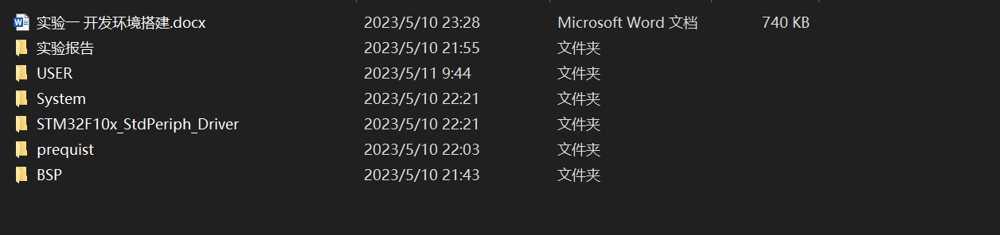
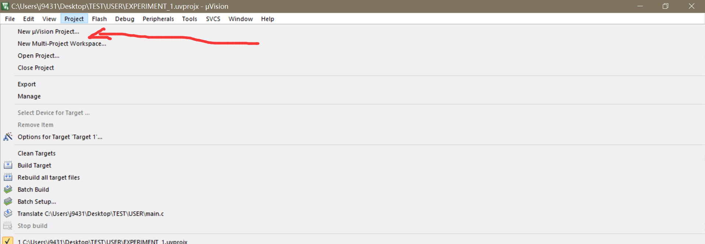
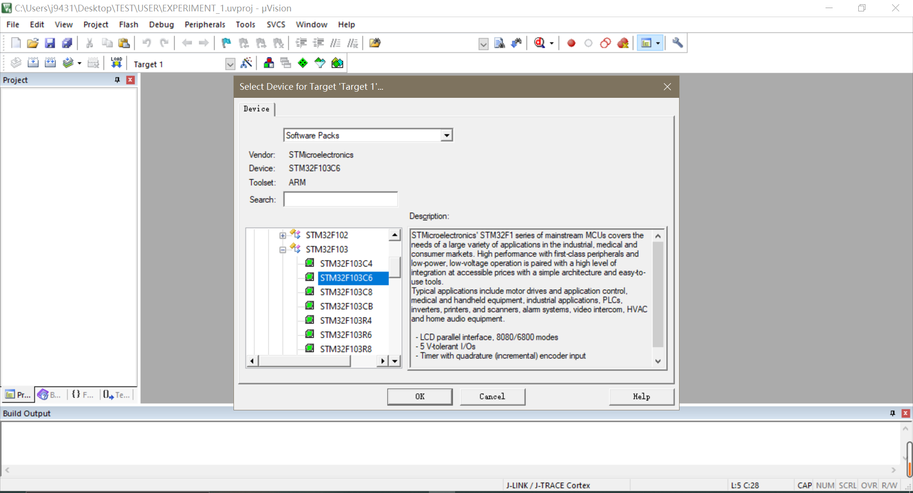
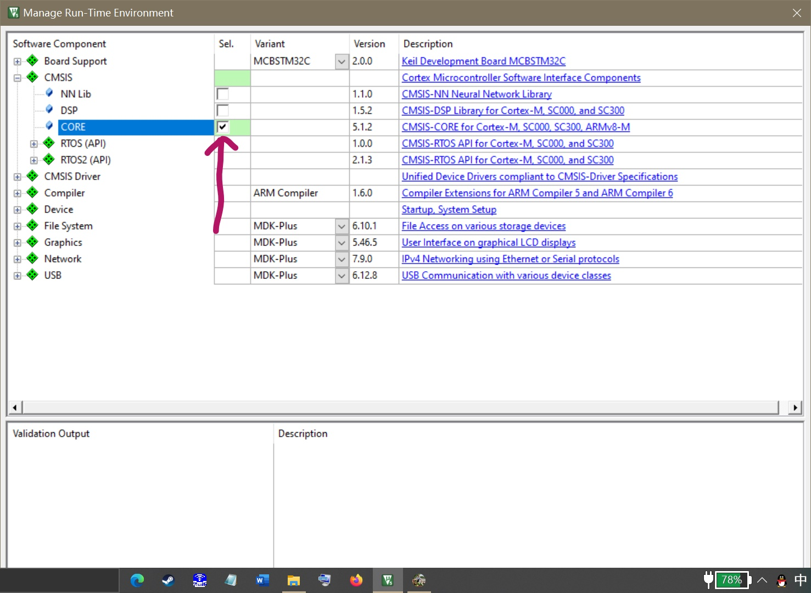
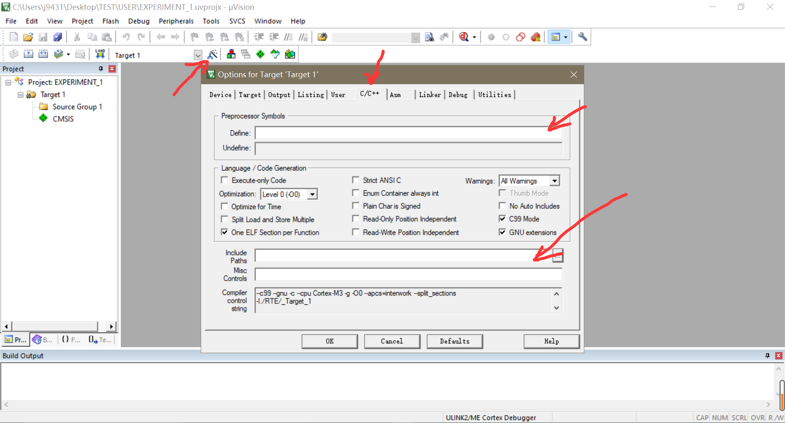
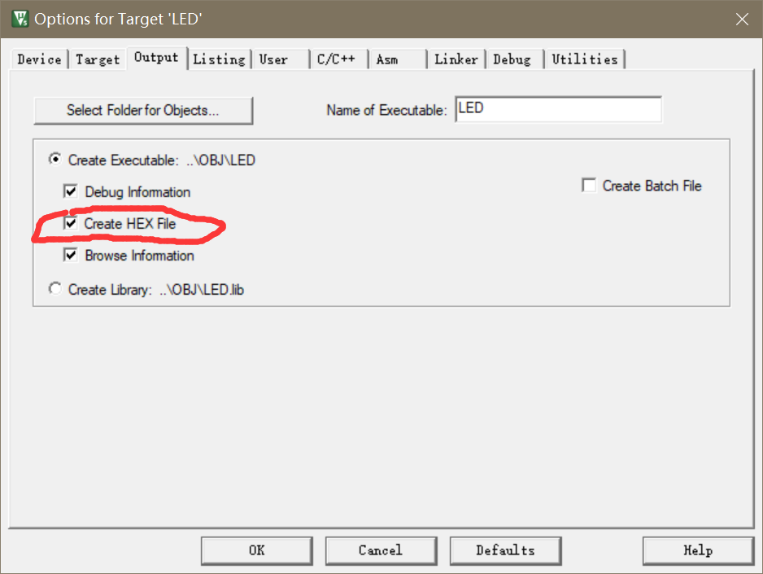
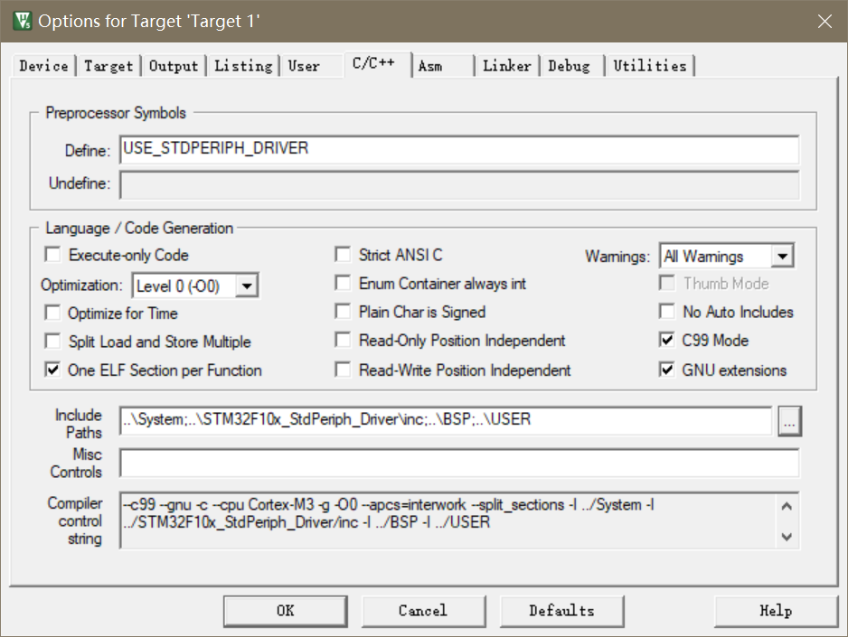
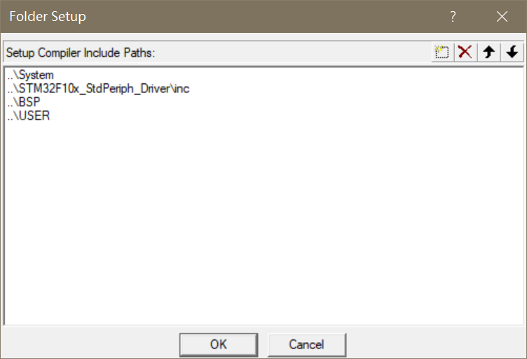
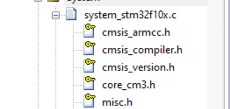
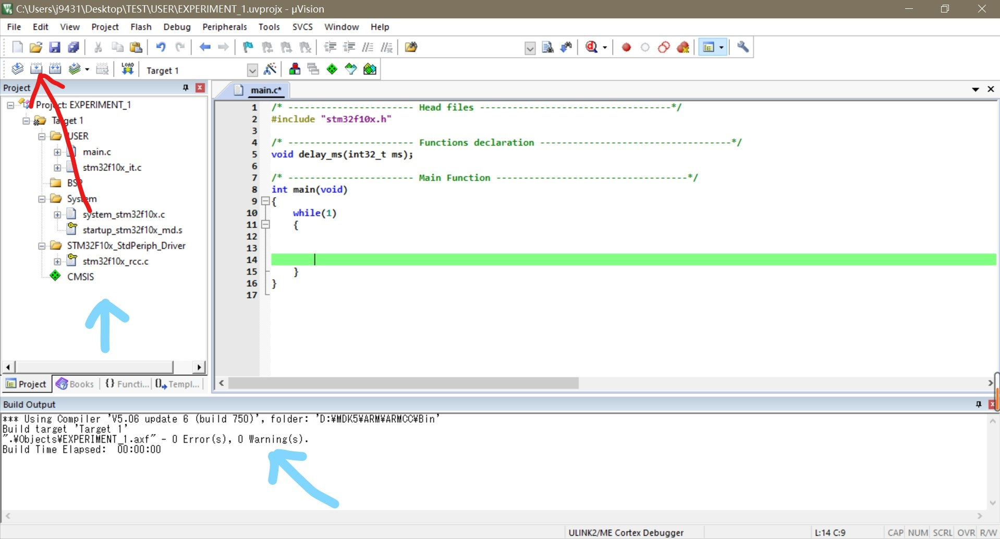

# 单片机开发软件keil的环境配置

---

## 1、下载库及源码，建立文件夹等

    我下载了群里面发的“4-1.var“文件，以及”en.stsw-stm32054.zip“文件。并且把他们放到”prequist“文件夹里面进行解压。

而”BSP“、”System“、”STM32F10x_StdPeriph_Driver“、”USER“是依照书上的要求进行的创建，这一步是为了方便对头文件路径的定位，也是为了方便查阅（一个项目通常会有很多的头文件依赖）。

---

## 2、新建Project，配置环境

    点击菜单上面的”Project“，下拉菜单里面的第一的选项就是。

    新建完成之后会有选型一项，也就是对所要烧录的单片机的型号的选定，以便后续能正确生成”Target“。

    选型结束就会弹出”runtime“窗口，这一步点开”CMSIS“左边的”+“号，然后在”CORE“后面打勾即可。

    接下来，点击”Target_1“旁边的“魔法棒”图标，用于配置后续部分——一个是”define“，即宏；另一个是”Include Path“,也就是去哪里找到头文件的路径。

   “Output”选项卡要打勾，在编译结束后生成对应的16进制码，这个.hex文件在之后的烧录中会有用。

    宏定义的的配置如图（一定要正确不然找不对）。

    头文件路径添加如上（点击上面的小框框是”添加路径”，小叉叉是“删除”）

    可以发现，这里添加的文件夹都是大家自己手动新建，并且往里面放了东西的。有的文件夹虽然没放头文件——譬如”System“文件夹，里面只有“startup_stm32f10x_md.s”和“system_stm32f10x.c”两个文件，但是我们在keil工程里面看会发现“system_stm32f10x.c”里面还是会有很多头文件（黄色的钥匙表示“只读文件”）。

## 3、编译

    编译前记得把主函数里面的东西清空（不加while循环也行）；编译键是红色箭头指向的地方。

最后，你会在底下的“Read Output”视窗里面看见没有错误和警告，并且“Target”已经被“build”，这意味这 目前的代码 的环境已经配好了。（如果有别的代码，比如没有删除原始的代码，会有报错。其原因就是那些代码的依赖没加上，还要向上面那样添加路径什么的。）

---

# 总结

  此实验的目的是掌握代码编译环境的配置，是单片机开发的第一步。因为是用现成的库函数进行开发，需要找到对应的库及依赖，且单片机开发本身包括了烧录，有驱动方面的东西要考虑，其内容比较繁琐。不过总体来说，也不算很难。

    在实践中，一般将所有可能用到的依赖都加上，虽然编译时间会变长，但是起码不用担心“未定义”的问题。这样一来，每次新建工程，只需要把这个”包罗万象“的模板copy一份拿过来写代码就行，不用再配什么环境了。
